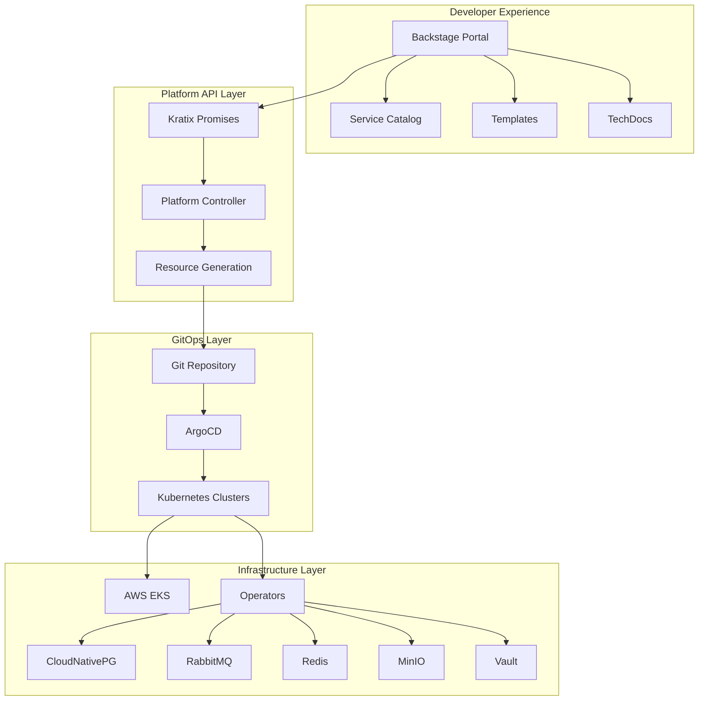

# InfraForge Platform Architecture

## 🏗️ Platform Engineering Stack

### Overview
InfraForge is an enterprise-grade Internal Developer Platform (IDP) that provides self-service infrastructure provisioning through a unified developer portal.



## 🎯 Key Components

### 1. **Backstage Developer Portal**
- **Purpose**: Single pane of glass for developers
- **Features**:
  - Software Catalog (all services, APIs, resources)
  - Software Templates (scaffolding new services)
  - TechDocs (integrated documentation)
  - Kubernetes plugin (resource visibility)
  - ArgoCD plugin (deployment status)
  - Cost insights
  - Security scorecards

### 2. **Kratix Platform-as-a-Service**
- **Purpose**: Platform API for resource provisioning
- **Components**:
  - **Promises**: Define what platform capabilities are available
  - **Workflows**: How resources are provisioned
  - **State Store**: Where generated manifests are stored
- **Flow**:
  1. Developer requests resource through Backstage
  2. Kratix Promise processes the request
  3. Pipeline generates Kubernetes manifests
  4. Manifests pushed to Git
  5. ArgoCD syncs to cluster

### 3. **GitOps with ArgoCD**
- **Purpose**: Declarative, version-controlled deployments
- **Features**:
  - ApplicationSets for multi-env deployments
  - Automated sync and self-healing
  - Progressive delivery support
  - Multi-cluster management
  - Helm native support

### 4. **AWS Infrastructure (OpenTofu)**
- **Purpose**: Cloud infrastructure management
- **Components**:
  - EKS clusters (control plane & data plane)
  - VPC with public/private subnets
  - NAT Gateways for outbound traffic
  - VPC endpoints for AWS services
  - IAM roles for service accounts (IRSA)
  - KMS for encryption
  - S3 for backups

## 🔄 Deployment Workflows

### Local Development (Kind)
```bash
make local-setup
# Creates 4-node Kind cluster with all operators
```

### AWS Development
```bash
make aws-init ENVIRONMENT=dev
make aws-plan ENVIRONMENT=dev
make aws-apply ENVIRONMENT=dev
make aws-kubeconfig ENVIRONMENT=dev
make deploy-platform ENVIRONMENT=dev
```

### AWS Production
```bash
make aws-init ENVIRONMENT=prod
make aws-plan ENVIRONMENT=prod
make aws-apply ENVIRONMENT=prod
make aws-kubeconfig ENVIRONMENT=prod
make deploy-platform ENVIRONMENT=prod
```

## 📊 Environment Configurations

| Component | Development | Production |
|-----------|------------|------------|
| **EKS Nodes** | 2 x t3.medium (SPOT) | 3 x t3.xlarge (ON_DEMAND) |
| **Database Nodes** | None | 2 x r6i.xlarge |
| **NAT Gateways** | 1 (single AZ) | 3 (multi AZ) |
| **PostgreSQL** | 1 replica, 10Gi | 2-3 replicas, 20Gi, HA |
| **RabbitMQ** | 1 replica | 2-3 replicas, HA |
| **Redis** | No persistence | Persistent, clustered |
| **MinIO** | 1 node, 10Gi | 2-4 nodes, 50Gi+ |
| **Vault** | File backend | Raft backend, auto-unseal |
| **Backup** | Disabled | Velero to S3 |
| **Monitoring** | Prometheus only | Full stack (Prometheus + Grafana) |

## 🔐 Security Features

### Network Security
- Private EKS API endpoint
- Private subnets for workloads
- Network policies
- Service mesh ready (Istio/Linkerd)

### Identity & Access
- OIDC provider for IRSA
- RBAC with SSO integration
- Secrets management with Vault
- Encryption at rest with KMS

### Supply Chain Security
- Container image scanning
- Policy enforcement (OPA/Kyverno ready)
- GitOps for audit trail
- Signed commits

## 🚀 Developer Self-Service Flow

1. **Browse Catalog**: Developer opens Backstage portal
2. **Choose Template**: Select microservice template
3. **Configure Service**: Fill in service parameters
4. **Select Infrastructure**: Choose database, cache, messaging needs
5. **Create Repository**: Backstage creates GitHub repo
6. **Generate Infrastructure**: Kratix processes the request
7. **Deploy Service**: ArgoCD syncs to Kubernetes
8. **Monitor Service**: View in Backstage dashboard

## 📈 Scalability

### Horizontal Scaling
- Cluster Autoscaler for nodes
- HPA for pods
- KEDA for event-driven scaling

### Multi-Region Support
- Cross-region replication
- Global load balancing
- Disaster recovery

### Multi-Tenancy
- Namespace isolation
- Resource quotas
- Network policies
- Cost allocation

## 🔧 Operations

### Day-2 Operations
- Automated backups with Velero
- Monitoring with Prometheus/Grafana
- Log aggregation with Fluentd/Loki
- Distributed tracing with Jaeger
- Chaos engineering with Litmus

### CI/CD Integration
- GitHub Actions for app builds
- Tekton for in-cluster pipelines
- ArgoCD for deployments
- Flagger for progressive delivery

## 📝 Platform APIs

### Kratix Promise Spec
```yaml
apiVersion: platform.infraforge.io/v1
kind: InfraForge
spec:
  tenant: team-name
  environment: dev|staging|prod
  database:
    enabled: true
    type: postgresql
    size: 10Gi
  cache:
    enabled: true
  messaging:
    enabled: true
  objectStorage:
    enabled: true
```

### Backstage Template Variables
- Service name, description, owner
- Environment (dev/staging/prod)
- Infrastructure components
- Resource limits
- Scaling parameters
- Monitoring configuration

## 🎭 Backstage Integration Points

### Catalog Entities
- **Domains**: Business domains
- **Systems**: Technical systems
- **Components**: Services, libraries, websites
- **APIs**: REST, GraphQL, gRPC
- **Resources**: Databases, queues, buckets
- **Groups**: Teams and users

### Plugins Ecosystem
- Kubernetes backend
- ArgoCD backend
- AWS Cost insights
- Security insights
- TechDocs backend
- GitHub integration
- Prometheus metrics

## 📊 Observability Stack

### Metrics
- Prometheus for metrics collection
- Grafana for visualization
- Custom dashboards per service
- SLO/SLI tracking

### Logs
- Fluentd for log collection
- Elasticsearch/Loki for storage
- Kibana/Grafana for visualization

### Traces
- OpenTelemetry instrumentation
- Jaeger for trace storage
- Service dependency maps

## 🚦 Platform Maturity Model

### Level 1: Foundation ✅
- [x] Kubernetes clusters
- [x] Basic operators
- [x] GitOps with ArgoCD
- [x] Local development

### Level 2: Self-Service ✅
- [x] Backstage portal
- [x] Service templates
- [x] Kratix promises
- [x] Automated provisioning

### Level 3: Production Ready 🚧
- [x] Multi-environment
- [x] HA configurations
- [x] Backup/restore
- [ ] Disaster recovery
- [ ] Cost optimization

### Level 4: Advanced 📋
- [ ] Multi-cloud support
- [ ] Policy automation
- [ ] ML/AI workloads
- [ ] Edge computing

## 🔄 Next Steps

1. **Security Hardening**
   - Implement OPA policies
   - Add image scanning
   - Enable mTLS with service mesh

2. **Cost Optimization**
   - Implement Karpenter for better node management
   - Add FinOps dashboards
   - Resource right-sizing recommendations

3. **Developer Experience**
   - Add more Backstage templates
   - Implement preview environments
   - Add ChatOps integration

4. **Platform Intelligence**
   - AIOps for anomaly detection
   - Predictive scaling
   - Automated remediation

## 📚 References

- [Kratix Documentation](https://kratix.io)
- [Backstage.io](https://backstage.io)
- [Platform Engineering](https://platformengineering.org)
- [OpenTofu](https://opentofu.org)
- [ArgoCD](https://argo-cd.readthedocs.io)