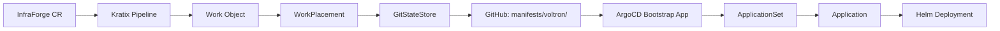

# Platform GitOps Flow - Detaylı Analiz

## 🔄 Akış Özeti



## 📁 GitHub Repository Yapısı

```
manifests/
└── voltron/                              # Kratix'in yazdığı root path
    ├── metadata.yaml                     # Kratix metadata
    ├── kratix-canary-*.yaml             # Kratix health check files
    └── <tenant>-<env>/                  # Tenant-Environment klasörü
        ├── apps/<tenant>/<env>/<service>/
        │   └── <service>-application.yaml    # ArgoCD Application
        └── argocd/<tenant>/<env>/
            └── services-appset.yaml          # ApplicationSet
```

## 🔍 Detaylı Akış

### 1. InfraForge CR Oluşturulduğunda:
```yaml
apiVersion: platform.infraforge.io/v1
kind: InfraForge
metadata:
  name: demo-nginx-v2
spec:
  tenant: demo
  environment: dev
  services:
  - name: web
    type: nginx
    profile: dev
```

### 2. Kratix Pipeline Çalışır:
- Go generator container başlar
- Template'leri render eder
- 3 dosya oluşturur:
  1. ArgoCD Application
  2. ApplicationSet
  3. metadata.yaml

### 3. Work Object Oluşur:
```yaml
workloads:
- filepath: demo-dev/apps/demo/dev/nginx/web-application.yaml
  content: <base64-encoded-application>
- filepath: demo-dev/argocd/demo/dev/services-appset.yaml  
  content: <base64-encoded-appset>
- filepath: metadata.yaml
  content: <base64-encoded-metadata>
```

### 4. GitStateStore'a Yazılır:
- Path: `manifests/voltron/`
- Branch: `feature/kratix`
- Repo: `https://github.com/gaskin1/PaaS-Platform.git`

### 5. ArgoCD Bootstrap App:
```yaml
source:
  path: manifests/voltron
  directory:
    include: '**/argocd/**/*.yaml'  # Sadece argocd klasörlerindeki YAML'lar
    recurse: true
```

### 6. ApplicationSet Oluşur:
```yaml
generators:
- git:
    directories:
    - path: manifests/voltron/demo-dev/apps/demo/dev/*
```

### 7. Application Deploy Edilir:
- Helm chart olarak nginx deploy edilir
- Namespace: `demo-dev`
- Release name: `web`

## 🤔 Önemli Noktalar

### 1. Neden Bu Kadar Derin Klasör Yapısı?
```
demo-dev/apps/demo/dev/nginx/
         └─┬─┘ └─┬─┘└┬┘ └┬┘
           │     │   │   └── Service name
           │     │   └────── Environment (tekrar?)
           │     └────────── Tenant (tekrar?)
           └──────────────── Apps klasörü (sabit)
```

**Sorun**: Tenant ve environment bilgisi tekrar ediyor!

### 2. ApplicationSet Path Logic:
- Her tenant-env kombinasyonu için ayrı ApplicationSet
- ApplicationSet kendi klasöründeki apps/* path'ini tarar
- Bu da otomatik service discovery sağlıyor

### 3. Multi-Environment Desteği:
```
manifests/voltron/
├── demo-dev/        # Development
├── demo-staging/    # Staging
├── demo-prod/       # Production
├── myteam-dev/      # Farklı tenant
└── myteam-prod/
```

## 🚨 Potansiyel İyileştirmeler

### 1. Basitleştirilmiş Klasör Yapısı:
```
# Mevcut (karmaşık):
demo-dev/apps/demo/dev/nginx/

# Önerilen (basit):
demo-dev/apps/nginx/
```

### 2. Operator Desteği:
```
manifests/voltron/
├── platform/           # Platform-wide resources
│   └── operators/      # Shared operators
└── tenants/           # Tenant resources
    └── demo-dev/
```

### 3. Environment-Specific Configs:
```go
// Generator'da environment bazlı konfigürasyon
if spec.Environment == "prod" {
    // Add PodDisruptionBudget
    // Add HorizontalPodAutoscaler
    // Enable monitoring
}
```

## ❓ Cevaplanan Sorular

1. **manifests klasörü ne işe yarıyor?**
   - Kratix'in GitOps state'i için kullandığı klasör
   - GitHub'a push edilen tüm manifest'ler burada

2. **Kratix'in oluşturduğu yapı nasıl?**
   - Hiyerarşik: tenant-env/apps/tenant/env/service/
   - Her servis için ayrı klasör
   - ApplicationSet ile otomatik discovery

3. **Multi-environment nasıl çalışıyor?**
   - Her environment için ayrı klasör
   - Aynı cluster'da namespace isolation
   - Future: Multi-cluster support mümkün

4. **Neden bu kadar karmaşık?**
   - Tam isolation için
   - GitOps best practices
   - Scalability için hazır