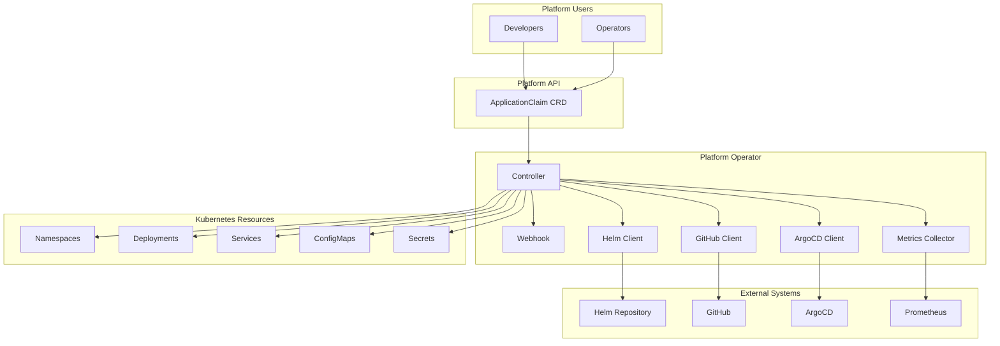

# Platform Operator

[](https://github.com/your-org/platform-operator/actions/workflows/ci.yaml)
[](https://goreportcard.com/report/github.com/your-org/platform-operator)
[](https://opensource.org/licenses/Apache-2.0)
[](https://golang.org/doc/go1.21)

## Overview

Platform Operator is a Kubernetes operator that provides a self-service platform for development teams to deploy and manage applications with minimal operational overhead. It abstracts complex Kubernetes resources behind simple, declarative APIs.

## Features

- **🚀 Self-Service Application Deployment**: Teams can deploy applications using simple ApplicationClaim resources
- **📦 Component Management**: Automated provisioning of databases, caches, and other infrastructure components
- **🔄 GitOps Integration**: Native integration with ArgoCD for GitOps workflows
- **📊 Observability**: Built-in Prometheus metrics and OpenTelemetry tracing
- **🔒 Multi-Tenancy**: Secure isolation between different teams and environments
- **⚡ Auto-Scaling**: Automatic horizontal and vertical scaling based on metrics
- **🛡️ Security**: Webhook validation, RBAC, and security scanning
- **🎯 Helm Support**: Deploy applications using Helm charts
- **🔗 GitHub Integration**: Deploy applications directly from GitHub releases

## Architecture



## Quick Start

### Prerequisites

- Kubernetes cluster (v1.25+)
- kubectl configured to access your cluster
- Helm 3.x (optional)
- Go 1.21+ (for development)

### Installation

#### Using Helm

```bash
# Add the platform operator helm repository
helm repo add platform-operator https://charts.platform.example.com
helm repo update

# Install the operator
helm install platform-operator platform-operator/platform-operator \
  --namespace platform-operator-system \
  --create-namespace \
  --set metrics.enabled=true \
  --set monitoring.prometheus.enabled=true
```

#### Using Kustomize

```bash
# Install CRDs
kubectl apply -f https://github.com/your-org/platform-operator/releases/latest/download/crds.yaml

# Install operator
kubectl apply -f https://github.com/your-org/platform-operator/releases/latest/download/install.yaml
```

#### From Source

```bash
# Clone the repository
git clone https://github.com/your-org/platform-operator.git
cd platform-operator

# Install CRDs
make install

# Deploy operator
make deploy
```

### Usage

#### Deploy a Simple Application

```yaml
apiVersion: platform.infraforge.io/v1
kind: ApplicationClaim
metadata:
  name: my-app
  namespace: default
spec:
  namespace: my-app-namespace
  environment: production
  owner:
    team: Platform Team
    email: team@example.com
  applications:
    - name: backend-service
      version: v1.0.0
      replicas: 3
      repository: github.com/example/backend-service
      ports:
        - name: http
          port: 8080
          protocol: TCP
      env:
        - name: ENVIRONMENT
          value: production
```

Apply the ApplicationClaim:

```bash
kubectl apply -f my-app.yaml
```

Check status:

```bash
kubectl get applicationclaim my-app -o yaml
kubectl get pods -n my-app-namespace
```

#### Deploy with Components

```yaml
apiVersion: platform.infraforge.io/v1
kind: ApplicationClaim
metadata:
  name: full-stack-app
  namespace: default
spec:
  namespace: full-stack
  environment: production
  owner:
    team: Full Stack Team
    email: fullstack@example.com
  applications:
    - name: frontend
      version: v2.0.0
      replicas: 2
      ports:
        - name: http
          port: 3000
    - name: backend
      version: v1.5.0
      replicas: 3
      ports:
        - name: http
          port: 8080
      env:
        - name: DATABASE_URL
          value: postgresql://$(POSTGRES_HOST):5432/mydb
        - name: REDIS_URL
          value: redis://$(REDIS_HOST):6379
  components:
    - type: postgresql
      name: main-database
      version: "14"
    - type: redis
      name: cache-layer
      version: "7.0"
```

## Configuration

### Environment Variables

| Variable | Description | Default |
|----------|-------------|---------|
| `METRICS_ADDR` | Metrics bind address | `:8080` |
| `HEALTH_PROBE_ADDR` | Health probe bind address | `:8081` |
| `LEADER_ELECT` | Enable leader election | `false` |
| `ARGOCD_SERVER` | ArgoCD server URL | - |
| `ARGOCD_TOKEN` | ArgoCD authentication token | - |
| `GITHUB_TOKEN` | GitHub API token | - |
| `ENABLE_WEBHOOKS` | Enable admission webhooks | `true` |
| `LOG_LEVEL` | Log level (debug, info, warn, error) | `info` |

### Helm Values

```yaml
# values.yaml
replicaCount: 1

image:
  repository: ghcr.io/your-org/platform-operator
  tag: latest
  pullPolicy: IfNotPresent

resources:
  limits:
    cpu: 500m
    memory: 512Mi
  requests:
    cpu: 100m
    memory: 256Mi

metrics:
  enabled: true
  serviceMonitor:
    enabled: true

monitoring:
  prometheus:
    enabled: true
  grafana:
    enabled: true
    dashboards:
      enabled: true

tracing:
  enabled: false
  jaeger:
    endpoint: http://jaeger-collector:14268/api/traces

argocd:
  enabled: true
  server: https://argocd.example.com
  namespace: argocd

webhooks:
  enabled: true
  failurePolicy: Fail
```

## API Reference

### ApplicationClaim

The ApplicationClaim resource is the primary API for deploying applications.

#### Spec Fields

| Field | Type | Description |
|-------|------|-------------|
| `namespace` | string | Target namespace for the application |
| `environment` | string | Environment (development, staging, production) |
| `owner` | OwnerSpec | Team ownership information |
| `applications` | []ApplicationSpec | List of applications to deploy |
| `components` | []ComponentSpec | Infrastructure components (databases, caches, etc.) |

#### Status Fields

| Field | Type | Description |
|-------|------|-------------|
| `ready` | bool | Overall readiness status |
| `applicationsReady` | bool | All applications are ready |
| `componentsReady` | bool | All components are ready |
| `conditions` | []Condition | Detailed status conditions |
| `observedGeneration` | int64 | Last observed generation |

## Monitoring

### Prometheus Metrics

The operator exposes the following metrics:

| Metric | Type | Description |
|--------|------|-------------|
| `platform_operator_application_claims_total` | Gauge | Total number of ApplicationClaims |
| `platform_operator_applications_deployed_total` | Gauge | Total applications deployed |
| `platform_operator_reconciliations_total` | Counter | Total reconciliation attempts |
| `platform_operator_reconciliation_duration_seconds` | Histogram | Reconciliation duration |
| `platform_operator_reconciliation_errors_total` | Counter | Reconciliation errors |

### Grafana Dashboard

Import the provided dashboard for comprehensive monitoring:

```bash
kubectl apply -f config/monitoring/grafana-dashboard.yaml
```

## Development

### Prerequisites

- Go 1.21+
- Docker
- Kind (for local testing)
- Kubebuilder 3.x

### Local Development

```bash
# Clone repository
git clone https://github.com/your-org/platform-operator.git
cd platform-operator

# Install dependencies
go mod download

# Generate code
make generate

# Run tests
make test

# Run locally against cluster
make run

# Build and push image
make docker-build docker-push IMG=your-registry/platform-operator:tag
```

### Testing

```bash
# Unit tests
make test

# Integration tests
make test-integration

# E2E tests
make test-e2e

# All tests with coverage
make test-all
```

### Contributing

Please read [CONTRIBUTING.md](CONTRIBUTING.md) for details on our code of conduct and the process for submitting pull requests.

## Troubleshooting

### Common Issues

#### Operator not starting

```bash
# Check operator logs
kubectl logs -n platform-operator-system deployment/platform-operator-controller-manager

# Check events
kubectl get events -n platform-operator-system --sort-by='.lastTimestamp'
```

#### ApplicationClaim stuck in pending

```bash
# Check claim status
kubectl describe applicationclaim <name>

# Check operator logs for errors
kubectl logs -n platform-operator-system deployment/platform-operator-controller-manager | grep -i error
```

#### Metrics not available

```bash
# Check metrics service
kubectl get service -n platform-operator-system platform-operator-metrics-service

# Test metrics endpoint
kubectl port-forward -n platform-operator-system deployment/platform-operator-controller-manager 8080:8080
curl http://localhost:8080/metrics
```

## Security

### Security Considerations

- All communication is encrypted using TLS
- Webhook validation prevents invalid resources
- RBAC policies restrict operator permissions
- Regular security scanning with Trivy, Snyk, and gosec
- Container images are signed and verified

### Reporting Security Issues

Please report security vulnerabilities to security@example.com

## License

This project is licensed under the Apache License 2.0 - see the [LICENSE](LICENSE) file for details.

## Support

- 📧 Email: support@example.com
- 💬 Slack: [#platform-operator](https://slack.example.com/channels/platform-operator)
- 🐛 Issues: [GitHub Issues](https://github.com/your-org/platform-operator/issues)
- 📚 Docs: [Documentation](https://docs.platform.example.com)

## Roadmap

- [ ] Multi-cloud support (AWS, Azure, GCP)
- [ ] Cost optimization features
- [ ] Advanced scheduling policies
- [ ] Service mesh integration
- [ ] Policy as Code integration
- [ ] AI-powered recommendations
- [ ] Backup and disaster recovery

## Acknowledgments

- Kubernetes community
- Kubebuilder project
- Controller-runtime contributors
- All our contributors and users